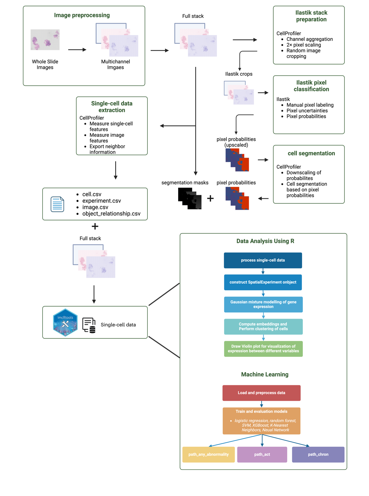

# IBD project
 Codes for the IBD project: machine learning of the severity of ibd histological images
# 🔬 Predicting Inflammation Severity in IBD with Machine Learning

This repository contains the workflow and code for **analyzing histopathology images of Inflammatory Bowel Disease (IBD) using machine learning.  
It integrates **image preprocessing, single-cell feature extraction, clustering, and predictive modeling**.

---

## 📂 Repository Structure
- **`ibd process image to multichannel again2.ipynb`**  
  Preprocessing of whole-slide images (resizing, normalization, multichannel conversion).

- **CellProfiler & Ilastik (external)**  
  Pixel classification and segmentation of nuclei, cytoplasm, and background; feature extraction.

- **`single-cell data analysis.Rmd`**  
  Construction of `SpatialExperiment` objects, clustering with Rphenograph + Gaussian Mixture Models, feature summarization.

- **`Machine learning of cell cluster data.Rmd`**  
  Training and evaluation of machine learning models (LR, RF, SVM, XGBoost, KNN, NN) with SMOTE balancing and cross-validation.

---

## ⚙️ Workflow
1. **Image Preprocessing** → Resize & convert to HED multichannel images  
2. **Pixel Classification & Segmentation** → CellProfiler & Ilastik  
3. **Single-Cell Data Analysis** → Clustering & feature extraction  
4. **Machine Learning** → Model training, evaluation (ROC-AUC, accuracy, precision, recall)

---

## 📊 Results
- **Best model for acute inflammation:** Random Forest (AUC = 0.746, Accuracy = 70.7%)  
- **Chronic inflammation detection:** Models showed lower performance (highest AUC = 0.632, SVM)  
- **Abnormality detection:** Neural Networks had highest AUC (0.612); SVM achieved better accuracy  

---

