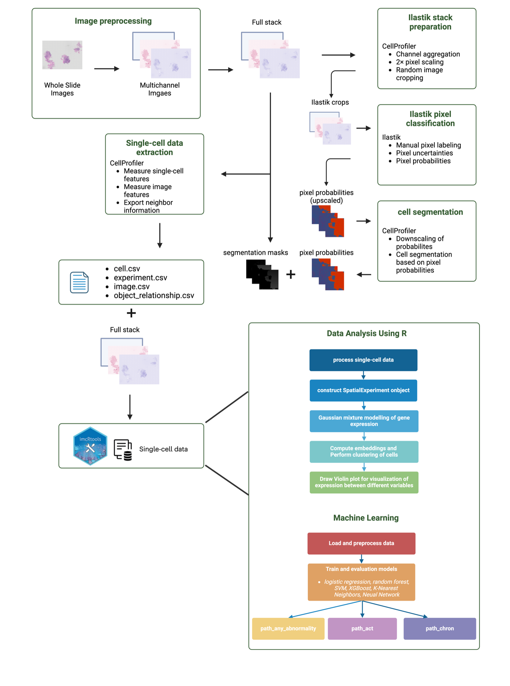

# IBD project
# 🔬 Predicting Inflammation Severity in IBD with Machine Learning

This repository contains the complete workflow and codebase for analyzing **histopathology whole-slide images (WSIs) of Inflammatory Bowel Disease (IBD)** using machine learning.  
The project demonstrates how image analysis and computational modeling can assist in **predicting the severity of inflammation** from routine H&E-stained biopsy slides.

---

## 📌 Project Overview
IBD is a chronic inflammatory condition of the gastrointestinal tract, typically classified into **Crohn’s disease** and **Ulcerative colitis**. Accurate assessment of disease severity is critical for diagnosis, prognosis, and treatment decisions. Traditional histopathology is labor-intensive and subject to variability between pathologists.  

This project aims to build an **automated pipeline** that extracts cellular features from WSIs and applies machine learning to classify:  
- **Abnormality detection** (normal vs abnormal samples)  
- **Acute inflammation** (presence/absence)  
- **Chronic inflammation** (presence/absence)  

---

## ⚙️ Workflow Highlights
The pipeline integrates multiple stages of computational pathology:

1. **Image Preprocessing**  
   - Resize whole-slide images to manageable dimensions  
   - Convert single-channel histology images into **multichannel HED space** (Hematoxylin, Eosin, DAB)  

2. **Pixel Classification & Segmentation**  
   - Use **CellProfiler** and **Ilastik** to classify pixels into nucleus, cytoplasm, and background  
   - Generate segmentation masks and extract per-cell features (morphology, intensity, spatial relationships)  

3. **Single-Cell Data Analysis**  
   - Build `SpatialExperiment` objects in R  
   - Perform clustering with **Rphenograph + Mclust** to group cells based on staining intensities  
   - Create cell- and cluster-level datasets  

4. **Machine Learning**  
   - Train multiple models (Logistic Regression, Random Forest, SVM, XGBoost, KNN, Neural Networks)  
   - Apply **5-fold cross-validation** with **SMOTE balancing** for class imbalance  
   - Evaluate using ROC-AUC, accuracy, precision, and recall  

---

## 🎯 Goal
By combining **digital pathology** with **machine learning**, this project provides a proof-of-concept for computationally assisted IBD assessment. The ultimate objective is to **support pathologists and clinicians** with faster, reproducible, and more accurate inflammation scoring.

---

## 📂 Repository Structure
- **`ibd process image to multichannel again2.ipynb`**  
  Preprocessing of whole-slide images (resizing, normalization, multichannel conversion).

- **CellProfiler & Ilastik (external)**  
  Pixel classification and segmentation of nuclei, cytoplasm, and background; feature extraction.

- **`single-cell data analysis.Rmd`**  
  Construction of `SpatialExperiment` objects, clustering with Rphenograph + Gaussian Mixture Models, feature summarization.

- **`Machine learning of cell cluster data.Rmd`**  
  Training and evaluation of machine learning models (LR, RF, SVM, XGBoost, KNN, NN) with SMOTE balancing and cross-validation.

---

## 📊 Results
- **Best model for acute inflammation:** Random Forest (AUC = 0.746, Accuracy = 70.7%)  
- **Chronic inflammation detection:** Models showed lower performance (highest AUC = 0.632, SVM)  
- **Abnormality detection:** Neural Networks had highest AUC (0.612); SVM achieved better accuracy  

---
## 🧭 Overview

